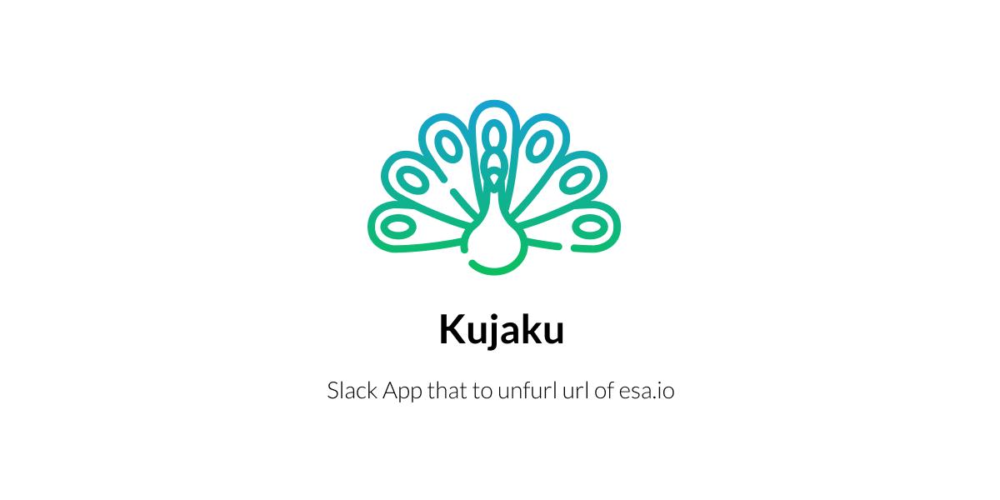

Slackに貼られたesaのURLを展開するSlack Appです。

## Cache
Kujakuには簡単なキャッシュ機構があります。これは、短時間に同一のesa URLがUnfurlされた場合に、esaのAPIを叩きすぎてRateLimitedにならない為に存在します。

キャッシュにはRedisもしくはFirestoreが利用できます。`.env.example`を参考に環境変数を指定することで、キャッシュに用いるサービスを選ぶことができます。なお、RedisとFirestoreの両方が利用可能な場合はRedisが優先されます。

## :warning:Herokuの無料枠が終了します:warning:

HerokuおよびHeroku Redisの無料枠は終了されます。KujakuをHerokuでホスティングする（している）場合はご注意ください。

- https://blog.heroku.com/next-chapter

## LICENSE
[MIT](LICENSE)

## Note
Icon made by Freepik from [www.flaticon.com](https://www.flaticon.com)
